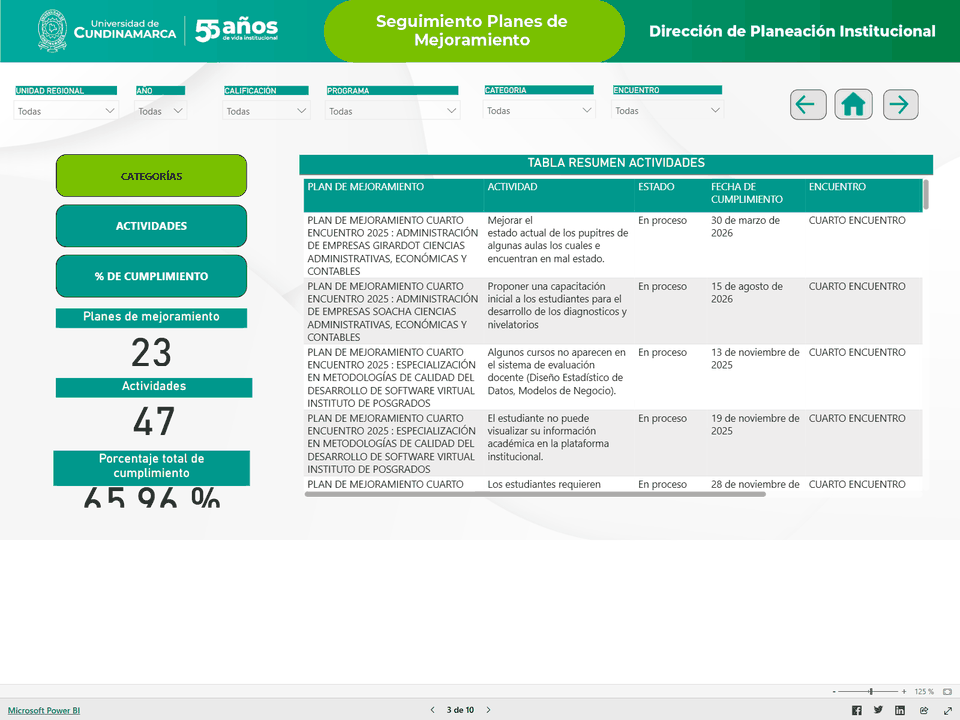
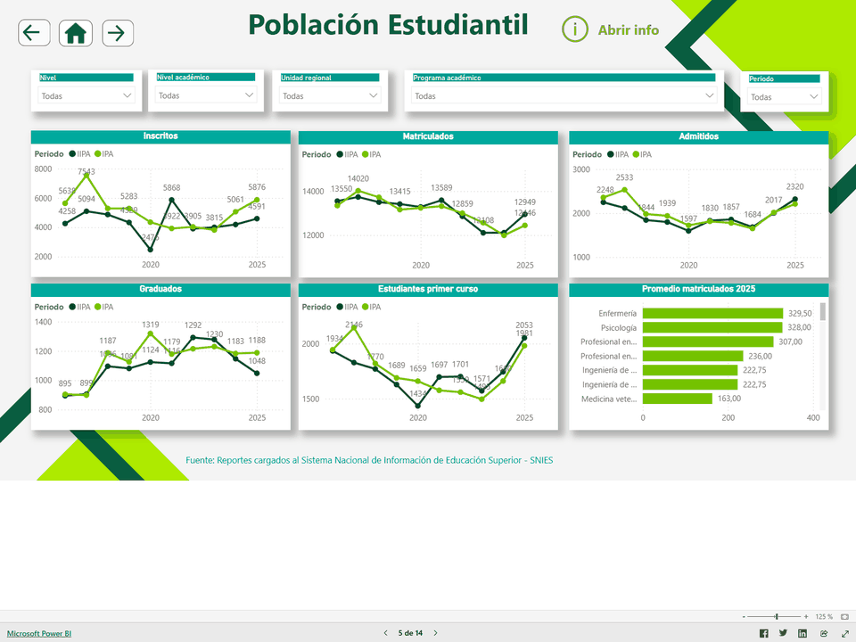

<h1>Hola, soy Nicolás Incháustegui 👋</h1>

 

  
  
  
  
  

  
  

  
  

**[`EXPLORAR PROYECTOS 🚀`](#proyectos-recientes-y-destacados)**

---

### 🧭 Navegacion
[**INICIO**](#home) &nbsp; | &nbsp; [**SOBRE MÍ**](#sobre-mi) &nbsp; | &nbsp; [**STACK**](#stack-principal) &nbsp; | &nbsp; [**PROYECTOS**](#proyectos-recientes-y-destacados) &nbsp; | &nbsp; [**POWER BI**](#power-bi) &nbsp; | &nbsp; [**GITHUB**](#actividad-en-github) &nbsp; | &nbsp; [**CONTACTO**](#contacto)

---

## 👨‍💻 01 / Sobre mí

Construyo soluciones donde el desarrollo de software, la automatización y el análisis de datos trabajan juntos para resolver problemas reales.

Mi enfoque combina **arquitectura técnica, limpieza y modelado de datos, visualización ejecutiva en Power BI** y uso práctico de **IA** para acelerar procesos, detectar patrones y convertir información dispersa en decisiones accionables.

> *"Disciplina sobre ruido. Sistemas sobre improvisación."*

  
  
  
  
  
  

---

## 🛠️ 02 / Stack principal

### 🌐 Frontend & Core

  
  
  
  
  

### ⚙️ Backend & Base de Datos

  
  
  
  
  
  

### 📊 Análisis de Datos & BI

  
  
  
  

### 🧰 Herramientas

  
  
  

---

## 🚀 03 / Proyectos Destacados

Desarrollo productos y soluciones donde la parte técnica va de la mano con la claridad de uso, la automatización y la capacidad de convertir información en decisiones útiles.

### 💻 Desarrollos Recientes

  
  
  
  
  

Aplicaciones y prototipos recientes enfocados en automatización, experiencia de usuario y herramientas prácticas para resolver flujos reales.

<table align="center">
  <tr>
    <td width="50%" valign="top">
      <h3>🟢 <a href="https://udec-data.vercel.app/">UdecData</a></h3>
      
<code>Next.js 16</code> <code>React 19</code> <code>TypeScript</code> <code>Supabase/PostgreSQL</code> <code>Prisma</code> <code>IA</code>

      
Portal de inteligencia académica para la Universidad de Cundinamarca que centraliza reportes, analítica institucional, pronóstico de población estudiantil y agentes de IA para soporte.

      
Incluye automatización de boletines, normalización de datos, dashboards filtrables y consultas read-only al analista de IA.

      
🔗 <a href="https://udec-data.vercel.app/">Demo</a> &nbsp; | &nbsp; 📦 <a href="https://github.com/Nicolaserd/UdecData">Repositorio</a>

    </td>
    <td width="50%" valign="top">
      <h3>🟡 <a href="https://nicolaserd.github.io/Astroproyectzodiac/">Lab Teoría de Juegos</a></h3>
      
<code>Astro</code> <code>TypeScript</code> <code>AHP</code> <code>Equilibrio de Nash</code>

      
Laboratorio interactivo para explorar teoría de juegos y toma de decisiones, con tests de perfil estratégico y módulos analíticos para trabajar equilibrio de Nash y AHP.

        
      
🔗 <a href="https://nicolaserd.github.io/Astroproyectzodiac/">Demo</a> &nbsp; | &nbsp; 📦 <a href="https://github.com/Nicolaserd/Astroproyectzodiac">Repositorio</a>

    </td>
  </tr>
  <tr>
    <td width="50%" valign="top">
      <h3>📱 <a href="https://github.com/Nicolaserd/Prestamo-App-Expo-Arquitectura-Modular-">Prestamo App</a></h3>
      
<code>React Native</code> <code>Expo</code> <code>SQLite</code> <code>Arquitectura modular</code>

      
Aplicación móvil para gestionar préstamos, beneficiarios, pagos y estadísticas locales, organizada con una arquitectura modular pensada para mantener orden y escalabilidad.

      
📦 <a href="https://github.com/Nicolaserd/Prestamo-App-Expo-Arquitectura-Modular-">Repositorio</a>

    </td>
    <td width="50%" valign="top">
      <h3>📈 <a href="https://github.com/Nicolaserd/Dashboarding_Service">Dashboarding Service</a></h3>
      
<code>Plataforma B2B</code> <code>Arquitectura de servicio</code> <code>Dashboarding</code>

      
Propuesta de plataforma B2B para conectar empresas cliente con elaboradores de dashboards, centralizando gestión de proyectos y entrega de visualizaciones interactivas.

       
      
📦 <a href="https://github.com/Nicolaserd/Dashboarding_Service">Repositorio</a>

    </td>
  </tr>
</table>

### 📊 Power BI / Análisis de Datos

  
  
  
  
  

Proyectos de analítica y visualización construidos en Power BI, con énfasis en ETL, limpieza de datos, modelado y seguimiento de indicadores.

 

<table align="center">
  <tr>
    <td width="54%">
      
    </td>
    <td width="46%" valign="top">
      <h3>🎓 Encuentros Dialógicos</h3>
      
<code>ETL</code> <code>Limpieza de datos</code> <code>Cruce de bases</code> <code>DAX</code>

      
Dashboard de seguimiento orientado a consolidar planes de mejoramiento, asistencia y percepción de estudiantes y docentes a partir de múltiples fuentes institucionales.

      
El resultado es una vista clara para hacer seguimiento a compromisos, participación y satisfacción dentro del proceso institucional.

      
🔗 <a href="https://app.powerbi.com/view?r=eyJrIjoiMmY2ZWYwYTctMWVlZS00M2M2LWFiNGEtN2MzNGM1ODJhOWIyIiwidCI6IjA3ZGE2N2EwLTFmNDMtNGU4Yy05NzdmLTVmODhiNjQ3MGVlNiIsImMiOjR9">Ver dashboard interactivo</a>

    </td>
  </tr>
</table>

<table align="center">
  <tr>
    <td width="54%">
      
    </td>
    <td width="46%" valign="top">
      <h3>📈 Boletín Estadístico Institucional</h3>
      
<code>ETL</code> <code>Limpieza de datos</code> <code>DAX</code> <code>Analisis predictivo</code>

      
Tablero integral construido en Power BI para consolidar oferta académica, población estudiantil, talento humano, deserción, planta física e investigación.

      
Incorpora un ejercicio predictivo sobre deserción académica con análisis histórico y tratamiento de datos atípicos, facilitando la planeación.

      
🔗 <a href="https://app.powerbi.com/view?r=eyJrIjoiYzE4NzhiNzgtMmViMS00YTNkLTg5YTMtOWEwNjg1N2FiYTYzIiwidCI6IjA3ZGE2N2EwLTFmNDMtNGU4Yy05NzdmLTVmODhiNjQ3MGVlNiIsImMiOjR9">Ver dashboard interactivo</a>

    </td>
  </tr>
</table>

---

## 📈 04 / Actividad en GitHub

  
  
  

  
  

 

<table align="center">
  <tr>
    <td align="center"><strong>LENGUAJES POR REPOSITORIO</strong></td>
    <td align="center"><strong>LENGUAJES POR COMMITS</strong></td>
  </tr>
  <tr>
    <td align="center">
      
    </td>
    <td align="center">
      
    </td>
  </tr>
</table>

  
<strong>CALENDARIO DE CONTRIBUCIONES</strong>

  

---

## 🎯 05 / Enfoque de Trabajo

| Fase | Descripción |
| :---: | :--- |
| **01** | Entender el problema y la fuente real de los datos |
| **02** | Limpiar, estructurar y modelar con criterio |
| **03** | Convertir complejidad en lectura clara y accionable |
| **04** | Construir con rigor técnico y código limpio |
| **05** | Iterar hasta que el resultado sea completamente útil |

---

## 📬 06 / Contacto

### ¿Construimos algo juntos?

---

  
   
  KINETIC MONOLITH / PERFIL GITHUB • Diseñado con 🚀 por Nicolás Incháustegui

